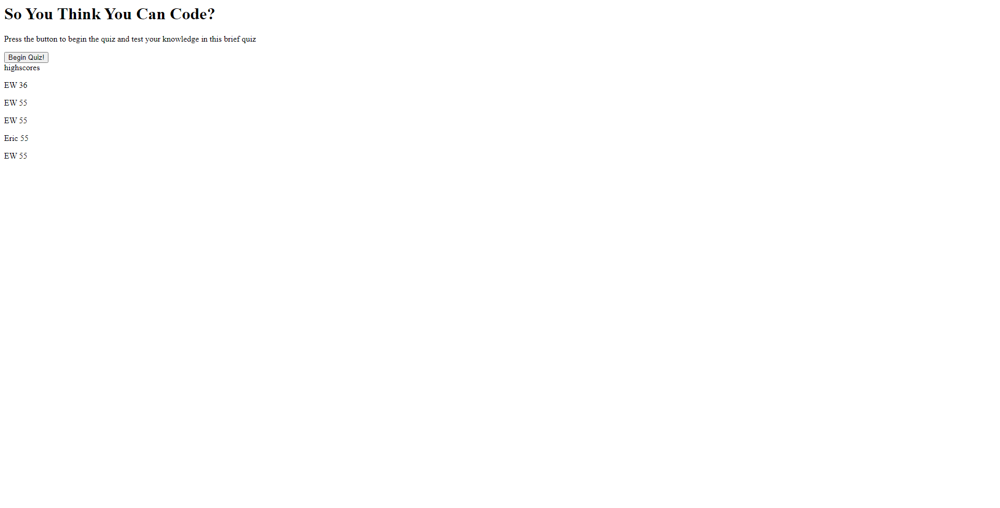

# Coding-Quiz

## Description

The purpose of this quiz is to learn how to display certain questions on a page and provide someone with possible answers and a time in which they are to complete it.

## Installation

N/A

## Usage

Use this quiz to test you knowledge on coding basics in a timed manner. Compare your scores over time.

## Credits

N/A

## License

Please refer to license present in the Github repository.

Link to deployed page - https://walleric23.github.io/Coding-Quiz/

